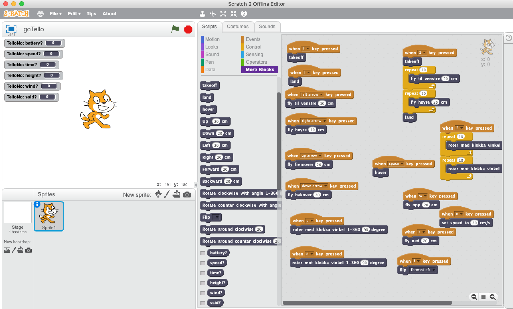

# gotelloscratch2

Backend plugin for Scratch 2 written in Go (Golang) to control a DJI Ryze Tello drone.

This package uses the Tello driver of [@SMerrony](https://github.com/postmannen/tello)

## Install

Import the block file into Scratch2 by holding down the SHIFT key + pressing the file menu. Choose "Import Experimental HTTP Extension". Choose the file named "scrath-no.s2e". The Tello blocks will be found under the "More Blocks" field in Scratch.
Start up your drone. Connect to the telloXXXX SSID, and start the executable found in the executables direcory of this repository.
Precomiled executables for Windows and Mac are provided.

If you are on Linux or any other platform and want to build and executable for that platform go to [http://golang.org](https://golang.org), follow the install instructions to install Go.
To compile/build a version for your platform, clone this repository with "git clone [https://github.com/postmannen/gotelloscratch2.git](https://github.com/postmannen/gotelloscratch2.git)", open a command-prompt/shell, and run "go build -o myExecutable main.go".